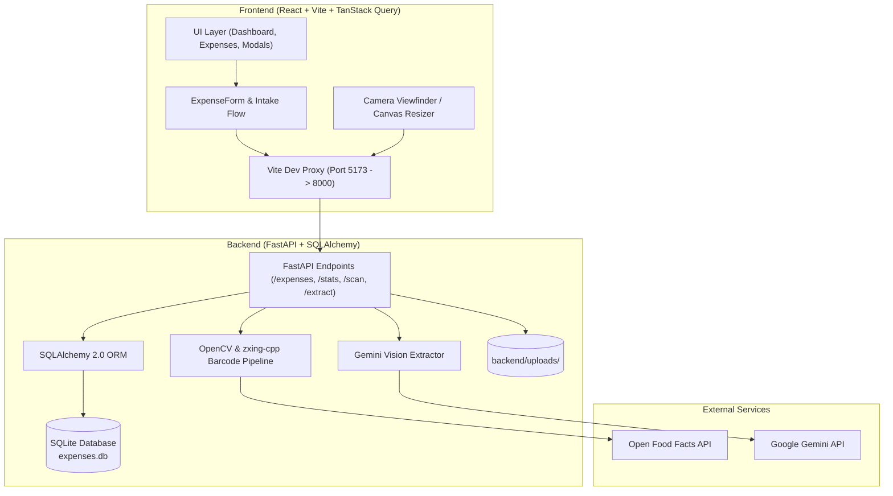

# SpendSense — Personal AI Expense Tracker

> A sleek, mobile-first personal finance tracker with multi-modal expense capture: scan barcodes, upload receipt/product photos for vision AI extraction, or enter manually. Built with **FastAPI**, **SQLite**, **React 19**, **Vite**, and **Tailwind CSS**.

---

## Key Features

- **Multi-Modal Expense Intake**:
  - **Live Barcode Scanning**: Decodes barcodes using `@zxing/browser` in the browser or via backend `zxing-cpp` with OpenCV multi-stage preprocessing (center-crop, grayscale, 2x upscale), then fetches product metadata, brand, and category from the **Open Food Facts** API.
  - **AI Receipt & Photo Extraction**: Upload bills, receipts, or product labels. Extracts item name, price, quantity, dates, and category via **Google Gemini Vision** (`gemini-3.6-flash`).
  - **Smart Category Resolution**: Auto-classifies items into categories (Groceries 🛒, Dining 🍽️, Transport 🚌, Health 💊, Household 🏠, Other 📦) using keyword heuristics.
  - **Human-in-the-Loop Review**: AI never saves directly to the database. All extracted values are presented in a prefilled form for verification.
- **Dynamic Dashboard & Spending Filters**:
  - Filter analytics by **Today**, **This Week**, **This Month (default)**, **This Year**, **Custom Month/Year**, or **Custom Date Range**.
  - Interactive **Category Donut** and **Daily Spending Trend** charts powered by Recharts.
  - Quick stat cards: Total Spend, Items Purchased, and vs Previous Period trend.
  - **Expiring Soon Alerts**: Tracks perishable groceries and warns about items expiring within 7 days.
- **Responsive PWA UI**:
  - **Desktop**: Collapsible sidebar (`w-64` $\leftrightarrow$ `w-20`) with icon tooltips and `localStorage` persistence.
  - **Mobile**: Top app bar with slide-out overlay drawer + bottom navigation bar.
  - **Expense Detail View**: Desktop centered modal or mobile bottom-sheet displaying full metadata, status pills, and uploaded receipt photos.
- **Financial Precision**:
  - Currency is Indian Rupee (INR), stored strictly as **integer paise** (`₹10.50` = `1050`) to eliminate floating-point rounding errors.

---

## Tech Stack

| Layer | Technologies |
| :--- | :--- |
| **Frontend** | React 19, Vite, TypeScript, Tailwind CSS, Framer Motion, TanStack Query (React Query v5), Recharts, Lucide Icons |
| **Backend** | Python 3.12+, FastAPI, Uvicorn, SQLAlchemy 2.0, Pydantic v2 |
| **Vision & Vision AI** | Google GenAI SDK (`gemini-3.6-flash`), OpenCV (`cv2`), `zxing-cpp` |
| **Database** | SQLite (with optional PostgreSQL support) |
| **External APIs** | Open Food Facts API, Google Gemini API |

---

## Architecture Overview



---

## Getting Started

### Prerequisites

- **Python**: 3.11 or higher
- **Node.js**: 18 or higher (with npm)
- **Google Gemini API Key** (from [Google AI Studio](https://aistudio.google.com/))

---

### 1. Backend Setup

1. Open a terminal and navigate to the `backend/` directory:
   ```bash
   cd backend
   ```

2. Create and activate a virtual environment:
   ```bash
   # Windows (PowerShell)
   python -m venv venv
   .\venv\Scripts\Activate.ps1

   # macOS / Linux
   python3 -m venv venv
   source venv/bin/activate
   ```

3. Install dependencies:
   ```bash
   pip install -r requirements.txt
   ```

4. Create a `.env` file in `backend/`:
   ```env
   GEMINI_API_KEY="your-gemini-api-key-here"
   GEMINI_VISION_MODEL=gemini-3.6-flash
   DATABASE_URL=sqlite:///./expenses.db
   ```

5. Start the FastAPI backend server:
   ```bash
   uvicorn app.main:app --reload --host 0.0.0.0 --port 8000
   ```
   The backend will start at `http://localhost:8000` (API Docs at `http://localhost:8000/docs`).

---

### 2. Frontend Setup

1. Open a second terminal and navigate to the `frontend/` directory:
   ```bash
   cd frontend
   ```

2. Install Node dependencies:
   ```bash
   npm install
   ```

3. Start the Vite development server:
   ```bash
   npm run dev
   ```

4. Open your browser:
   - **Local PC**: `http://localhost:5173/`
   - **Mobile (Same Wi-Fi)**: `http://<YOUR-PC-LOCAL-IP>:5173/` (e.g. `http://192.168.0.5:5173/`)

---

## API Reference

| Method | Endpoint | Description |
| :--- | :--- | :--- |
| `GET` | `/health` | Server health check |
| `GET` | `/categories` | List all categories with icons and colors |
| `POST` | `/categories` | Create a new custom category |
| `GET` | `/expenses` | List paginated expenses (supports `start_date`, `end_date`, `category_id`, `q`, `cursor`) |
| `POST` | `/expenses` | Create an expense (`item`, `price_paise`, `category_id`, `quantity`, `expiry_date`, etc.) |
| `PATCH` | `/expenses/{id}` | Update existing expense details |
| `DELETE` | `/expenses/{id}` | Delete an expense |
| `GET` | `/expenses/expiring?days=7` | List items expiring within the specified days |
| `GET` | `/stats/summary` | Aggregate spending metrics (supports `start_date`, `end_date`, or `month`) |
| `GET` | `/stats/by-category` | Category-wise expense breakdown for charts |
| `GET` | `/stats/trend` | Daily spending trend points |
| `POST` | `/api/scan/barcode` | Upload image for OpenCV + `zxing-cpp` barcode decoding & product lookup |
| `GET` | `/lookup/{barcode}` | Look up product details via barcode from Open Food Facts |
| `POST` | `/extract` | Upload receipt/item photo for Gemini AI vision extraction |

---

## Running Tests

### Backend Unit & Integration Tests
Run the 48 automated test suites using `pytest`:
```bash
cd backend
pytest
```

### Frontend Production Build
Validate TypeScript types and compile production assets:
```bash
cd frontend
npm run build
```

---

## Deployment Guide

### Frontend on Vercel
1. Push your repository to GitHub.
2. Go to [Vercel](https://vercel.com) -> **Add New Project** -> Import your repo.
3. Configure:
   - **Root Directory**: `frontend`
   - **Framework Preset**: `Vite`
   - **Environment Variable**: `VITE_API_URL` = `https://your-backend.onrender.com`
4. Click **Deploy**.

### Backend on Render
1. Go to [Render](https://render.com) -> **New Web Service** -> Connect your repo.
2. Configure:
   - **Root Directory**: `backend`
   - **Runtime**: `Python 3`
   - **Build Command**: `pip install -r requirements.txt`
   - **Start Command**: `uvicorn app.main:app --host 0.0.0.0 --port $PORT`
   - **Environment Variables**:
     - `GEMINI_API_KEY`: Your Google Gemini API key
     - `GEMINI_VISION_MODEL`: `gemini-3.6-flash`
     - *(Optional for persistent storage)* `DATABASE_URL`: PostgreSQL connection string from [Neon.tech](https://neon.tech)
3. Click **Create Web Service**.

---

## License

This project is open-source and available under the [MIT License](LICENSE).
# Expense-Tracker
